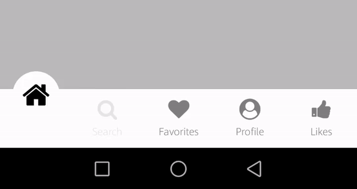
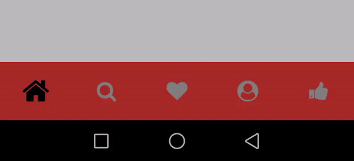
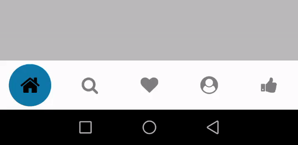

<h1>react-native-custom-navigation-tabs</h1>

A custom bottomTabNavigator which supports 5 different types of tabBar styling and animations.


<h1>Getting Started</h1>

**Install via npm**

```shell
npm i react-native-custom-navigation-tabs
```

<h1>Usage</h1>

Import the **TabBar** component from **react-native-custom-navigation-tabs**: 

```shell
import TabBar from 'react-native-custom-navigation-tabs'
```
<h1>Usage Example</h1>

```shell
import React from 'react';
import { createAppContainer } from 'react-navigation';
import { createBottomTabNavigator } from 'react-navigation-tabs';
import Icon from 'react-native-vector-icons/FontAwesome'

import TabBar from 'react-native-custom-navigation-tabs'

import { HomeScreen, SearchScreen, FavoritesScreen, ProfileScreen, LikeScreen } from './Screens'

const TabNavigator = createBottomTabNavigator(
  {
    Home: {
      screen: HomeScreen,
      navigationOptions: {
        tabBarIcon: ({ tintColor }) => <Icon size={25} name="home" style={{ color: tintColor }} />
      }
    },
    Search: {
      screen: SearchScreen,
      navigationOptions: {
        tabBarIcon: ({ tintColor }) => <Icon size={25} name="search" style={{ color: tintColor }} />
      }
    },
    Favorites: {
      screen: FavoritesScreen,
      navigationOptions: {
        tabBarIcon: ({ tintColor }) => <Icon size={25} name="heart" style={{ color: tintColor }} />
      }
    },
    Profile: {
      screen: ProfileScreen,
      navigationOptions: {
        tabBarIcon: ({ tintColor }) => <Icon size={25} name="user-circle" style={{ color: tintColor }} />
      }
    },
    Likes: {
      screen: LikeScreen,
      navigationOptions: {
        tabBarIcon: ({ tintColor }) => <Icon size={25} name="thumbs-up" style={{ color: tintColor }} />
      }
    }

  },
  {
    tabBarComponent: TabBar,    // pass TabBar here.
    tabBarOptions: {}        // discussed below.
  }
);

const TabNavigation = createAppContainer(TabNavigator)

export default TabNavigation;
```
As shown in above example, you need to add your ```icon``` in ```navigationOptions{}``` beside your screen and do remember to provide the ```style={{ color: tintColor }}``` to it as shown.

<h1>tabBarOptions</h1>

This is the place where we provide the type and custom styling to our tab navigator. Below are the tabBar options respective to each ```tabBarType```.

1. <h3>light</h3>
   
   
   
   ```tabBarOptions{}``` for this type will be - 
   ```shell
   tabBarOptions: {
      activeTintColor:   // **(optional)**, defaults to '#000000' if not provided. This is the color of the active icon.
      inactiveTintColor: // **(optional)**, defaults to 'grey' if not provided. This is the color of the inactive icon.
      tabBarBackgroundColor: // **(optional)**, defaults to '#ffffff' if not provided. This is the backgroundColor of the whole tab bar.
      tabBarHeight: // **(optional)**, defaults to 70 if not provided. This is the height of the tab bar.
      tabBarType: 'light', // **(important)**, and should be provided.
      numOfTabs: 5, // **(important)** and should be provided. It is the number of screens that are defined in navigator like in the above example it is 5.
   }
   ```
2. <h3>dark</h3>

   
   
   ```tabBarOptions{}``` for this type will be -  
   ```shell
   tabBarOptions: {
      activeTintColor:   // **(optional)**, defaults to '#ffffff' if not provided. This is the color of the active icon.
      inactiveTintColor: // **(optional)**, defaults to 'grey' if not provided. This is the color of the inactive icon.
      tabBarBackgroundColor: // **(optional)**, defaults to '#000000' if not provided. This is the backgroundColor of the whole tab bar.
      tabBarHeight: // **(optional)**, defaults to 70 if not provided. This is the height of the tab bar.
      tabBarType: 'dark', // **(important)**, and should be provided.
      numOfTabs: 5, // **(important)** and should be provided. It is the number of screens that are defined in navigator like in the above example it is 5.
   }
   ```
   
3. <h3>colorFillTab</h3>

   
   
   ```tabBarOptions{}``` for this type will be - 
   ```shell
   tabBarOptions: {
      activeTintColor: // **(optional)**, defaults to '#000000' if not provided. This is the color of the active icon.
      inactiveTineColor: // **(optional)**, defaults to 'grey' if not provided. This is the color of the active icon.
      tabBarHeight: // **(optional)**, defaults to 70 if not provided. This is the height of the tab bar.
      tabBarType: 'colorFillTab', // **(important)**, and should be provided.
      numOfTabs: 5, // **(important)** and should be provided. It is the number of screens that are defined in navigator like in the above example it is 5.
      activeBackgroundColor: {                // **(important)** and should be provided.
         Home: 'brown',
         Search: 'yellow',
         Favorites: 'purple',
         Profile: 'blue',
         Likes: 'pink'
      }
   }
   ```
**NOTE :** Here, ```activeBackgroundColor``` are the colors that the tabBar background takes corresponding to each tab. The key of each value should be exactly the same as the label of your tab.

4. <h3>bubbleTab</h3>

   
   
   ```tabBarOptions{}``` for this type will be - 
   ```shell
   tabBarOptions: {
      activeTintColor:   // **(optional)**, defaults to '#000000' if not provided. This is the color of the active icon.
      inactiveTintColor: // **(optional)**, defaults to 'grey' if not provided. This is the color of the inactive icon.
      tabBarBackgroundColor: // **(optional)**, defaults to '#ffffff' if not provided. This is the backgroundColor of the whole tab bar.
      tabBarHeight: // **(optional)**, defaults to 70 if not provided. This is the height of the tab bar.
      tabBarType: 'bubbleTab', // **(important)**, and should be provided.
      numOfTabs: 5, // **(important)** and should be provided. It is the number of screens that are defined in navigator like in the above example it is 5.
      activeBackgroundColor: // **(optional)**, defaults to '#DCDCDC' if not provided. This is the color that the active tab background takes.  
   }
   ```
5. <h3>zoomInOut</h3>

   
   
   ```tabBarOptions{}``` for this type will be - 
   ```shell
   tabBarOptions: {
      activeTintColor:   // **(optional)**, defaults to '#000000' if not provided. This is the color of the active icon.
      inactiveTintColor: // **(optional)**, defaults to 'grey' if not provided. This is the color of the inactive icon.
      tabBarBackgroundColor: // **(optional)**, defaults to '#ffffff' if not provided. This is the backgroundColor of the whole tab bar.
      tabBarHeight: // **(optional)**, defaults to 70 if not provided. This is the height of the tab bar.
      tabBarType: 'zoomInOut', // **(important)**, and should be provided.
      numOfTabs: 5, // **(important)** and should be provided. It is the number of screens that are defined in navigator like in the above example it is 5.
      activeBackgroundColor: // **(optional)**, defaults to '#1178A9' if not provided. This is the color that the active tab background takes.  
   }
   ```
This is all that needs to be done. Have a great time using this module. I hope it serves your purpose!
   
<h1>Build with: </h1>

* React
* react-native
* react-navigation
* react-navigation-tabs
* react-native-pose
* Animated
